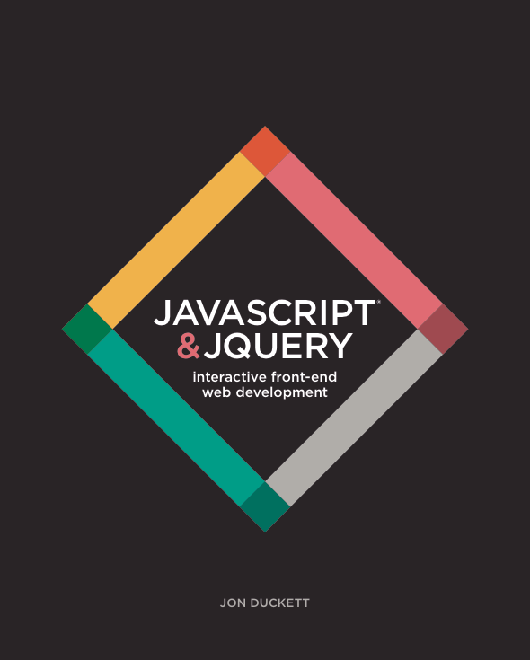

# Some important reference to know before we start.

| Sample or Icon       | Meaning                                                     |
| -------------------- | ----------------------------------------------------------- |
| :bulb:               | `Bulb` means a new idea.                                    |
| :information_source: | `Information` means a information better to know it.        |
| :abc:                | `abc` means a steps to follow.                              |
| :video_game:         | `Practice` Do what you have learned in practice (Exercise). |
| :gem:                | `Gem` means a very valuable information                     |

# Hi, My name is JavaScript

JavaScript was developed by `Brendan Eich`, a developer at Netscape Communications
Corporation, in 1995. JavaScript started life with the name `Mocha`, and was briefly named
`LiveScript` before being officially renamed to `JavaScript`.

It is a `scripting language` that is executed by the browser, i.e. on the client’s end. It is used in conjunction with HTML to develop responsive webpages.

# Audience:

1. To the people who wants to enter programming world.
2. Every one has the passion to learn and explorer web technologies as (Front-End).

# Course requirements:

1. Basics of english knowledge.
2. Basics of HTML & CSS. If not valid then we will go through them in a very light way. BUT we recommend you to learn them since they are fast and easy to learn.
3. Basic functional computer.
4. Web browser (Chrome recommended).
5. Github account (It's free to make).
6. Slack account (Free account).
7. Attendance.

## What is ECMAScript?

ECMAScript (ES) is a scripting language `specification standardized` by ECMAScript International. It is used by applications to enable client-side scripting. The specification is influenced by programming languages like Java, Self at time. Languages like `JavaScript`, `Jscript` and `ActionScript` are governed by this specification.

This tutorial introduces you to `ES6` and `ES5` implementation in `JavaScript` but use ES6 as you can for your future apps.

---

### References and Terms:

> :information_source: [scripting language](https://en.wikipedia.org/wiki/Scripting_language) A scripting or script language is a programming language that supports scripts — programs written for a special run-time environment that automates the execution of tasks that could alternatively be executed one-by-one by a human operator.

> [Book] reference of this course will be [javascript and jquery](http://javascriptbook.com) by Jon Duckett.

> [Codes] for this book that we are going to take, can be found [heM or CSS tags on the top right side of the page.

