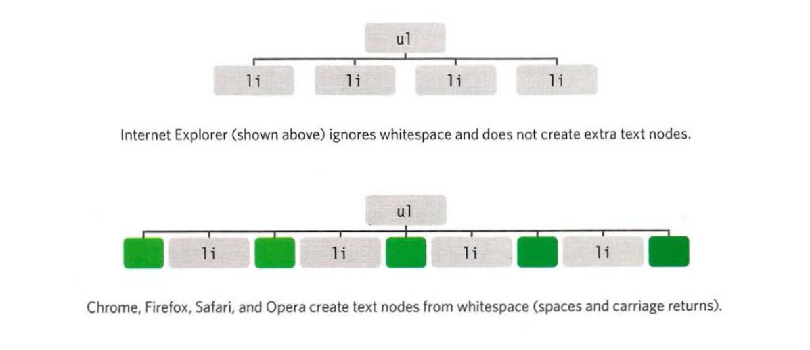
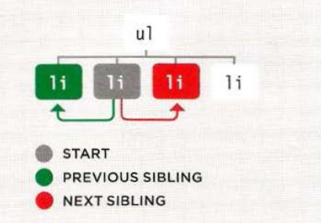

# Traversing the DOM

When you have an element node, you can select another element in relation to it using these five properties (grouped in 3 categories in relation). This is known as traversing t he DOM.

- `parentNode` to get the container element.
- `previousSibling`, `nextSibling` to get previous or next element of according to the current element.
- `firstChild`, `lastChild` to get the first or last element inside the container of elements.


## WHITESPACE NODES

Traversing the DOM can be difficult because some browsers add a text node whenever they come across whitespace between elements.



---

Let us see the same example about HTML and CSS

**HTML**

```HTML
<ul>
  <li id="one" class="hot"><em>fresh</em> figs</li>
  <li id="two" class="hot">pine nuts</li>
  <li id="three" class="hot">honey</li>
  <li id="four">balsamic vinegar</li>
</ul>
```

**CSS**

```css
@import url(http://fonts.googleapis.com/css?family=Oswald);

body {
  background-color: #000;
  font-family: "Oswald", "Futura", sans-serif;
  margin: 0px;
  padding: 0px;
}

#page {
  background-color: #403c3b;
  margin: 0px auto 0px auto;
}
/* Responsive page rules at bottom of style sheet */

h1 {
  background-image: url(../images/kinglogo.png);
  background-repeat: no-repeat;
  background-position: center center;
  text-align: center;
  text-indent: -1000%;
  height: 75px;
  line-height: 75px;
  width: 117px;
  margin: 0px auto 0px auto;
  padding: 30px 10px 20px 10px;
}

h2 {
  color: #fff;
  font-size: 24px;
  font-weight: normal;
  text-align: center;
  text-transform: uppercase;
  letter-spacing: 0.2em;
  margin: 0px 0px 23px 0px;
}

h2 span {
  border-radius: 50%;
  background-color: #000;
  font-size: 10px;
  text-align: center;
  display: inline-block;
  position: relative;
  top: -5px;
  height: 18px;
  width: 20px;
  margin-left: 5px;
  padding: 4px 0px 0px 4px;
}

ul {
  background-color: #584f4d;
  border: none;
  padding: 0px;
  margin: 0px;
}

li {
  background-color: #ec8b68;
  color: #fff;
  border-top: 1px solid #fe9772;
  border-bottom: 1px solid #9f593f;
  font-size: 24px;
  letter-spacing: 0.05em;
  list-style-type: none;
  text-shadow: 2px 2px 1px #9f593f;
  height: 50px;
  padding-left: 1em;
  padding-top: 10px;
}

.hot {
  background-color: #d7666b;
  color: #fff;
  text-shadow: 2px 2px 1px #914141;
  border-top: 1px solid #e99295;
  border-bottom: 1px solid #914141;
}

.cool {
  background-color: #6cc0ac;
  color: #fff;
  text-shadow: 2px 2px 1px #3b6a5e;
  border-top: 1px solid #7ee0c9;
  border-bottom: 1px solid #3b6a5e;
}

.complete {
  background-color: #999;
  color: #fff;
  background-image: url("../images/icon-trash.png");
  background-position: center right;
  background-repeat: no-repeat;
  text-shadow: 2px 2px 1px #ccc;
  border-top: 1px solid #666;
  text-shadow: 2px 2px 1px #333;
}

li a {
  color: #fff;
  text-decoration: none;
  background-image: url("../images/icon-link.png");
  background-position: center right;
  background-repeat: no-repeat;
  padding-right: 36px;
}

p {
  color: #403c3b;
  background-color: #fff;
  border-radius: 5px;
  text-align: center;
  padding: 10px;
  margin: 20px auto 20px auto;
  min-width: 20%;
  max-width: 80%;
}

#scriptResults {
  padding-bottom: 10px;
}

/* Small screen - acts like the app would */
@media only screen and (max-width: 500px) {
  body {
    background-color: #584f4d;
  }
  #page {
    max-width: 480px;
  }
}
@media only screen and (min-width: 501px) and (max-width: 767px) {
  #page {
    max-width: 480px;
    margin: 20px auto 20px auto;
  }
}
@media only screen and (min-width: 768px) and (max-width: 959px) {
  #page {
    max-width: 480px;
    margin: 20px auto 20px auto;
  }
}
/* Larger screens act like a demo for the app */
@media only screen and (min-width: 960px) {
  #page {
    max-width: 480px;
    margin: 20px auto 20px auto;
  }
}
@media (-webkit-min-device-pixel-ratio: 2), (min-resolution: 192dpi) {
  h1 {
    background-image: url(../images/2xkinglogo.png);
    background-size: 72px 72px;
  }
}
```

Let us see example found in example found in <a target="_blank" href="Chapter_05/Examples/c05/node-list.html">**Chapter_05/Examples/c05/node-list.html**</a>

## Apply previous & next sibling script

**JavaScript**

```js
// Select the starting point and find its siblings.
var startItem = document.getElementById("two");
var prevItem = startItem.previousSibling;
var nextItem = startItem.nextSibling;

// Change the values of the siblings' class attributes.
prevItem.className = "complete";
nextItem.className = "cool";
```



## Apply first & last child script

**JavaScript**

```js
// Select the starting point and find its siblings.
var startItem = document.getElementById("two");
var prevItem = startItem.previousSibling;
var nextItem = startItem.nextSibling;

// Change the values of the siblings' class attributes.
prevItem.className = "complete";
nextItem.className = "cool";
```


