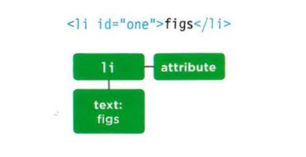
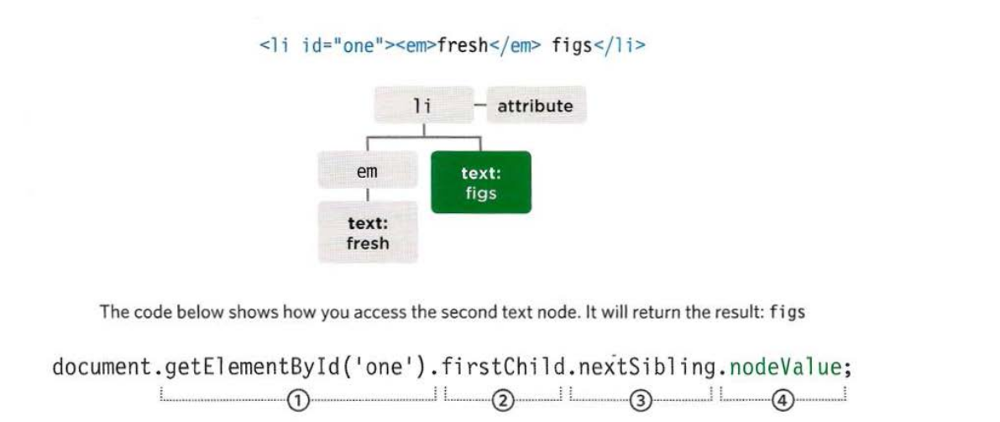
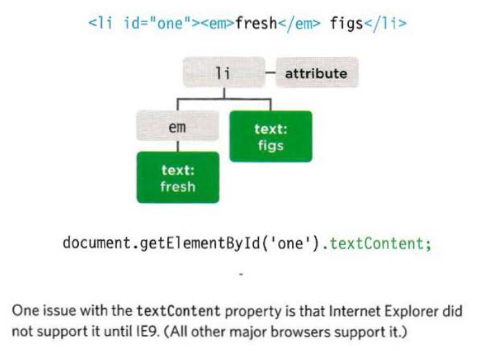

# How to GET/UPDATE element content

So far this chapter has focused on finding elements in the DOM tree. The rest of this chapter shows how to access/update element content. Your choice of techniques depends upon what the element contains.

Take a look at the same example of \<li> elements bellow. Each one adds some more markup and, as a result, the fragment of the DOM tree for each
list item is very different.

**HTML**

```HTML
<ul>
  <li id="one" class="hot"><em>fresh</em> figs</li>
  <li id="two" class="hot">pine nuts</li>
  <li id="three" class="hot">honey</li>
  <li id="four">balsamic vinegar</li>
</ul>
```

From the example we can:

1. **Navigate to the text node**. This works best when the element contains only text, no other elements.
2. **Work with the containing element**. This allows you to access its text nodes and child elements. It works better when an element has text nodes and child elements that are siblings.

### 1. TEXT NODES (Navigate to the text node)(Leave it if you can!):

Once you have navigated from an element to its text node, there is one property that you will commonly

| Property    | Description           |
| ----------- | --------------------- |
| `nodeValue` | Access text from node |



### 2. CONTAINING ELEMENT (Work with the containing element):

When you are working with an element node (rather than its text node), that element can contain markup. You have to choose whether you want to retrieve (get) or update (set) the markup as well as t he text.

| Property      | Description                             |
| ------------- | --------------------------------------- |
| `innerHTML`   | Get/Set text and markup                 |
| `textContent` | Get/Set text only                       |
| `innerText`   | Get/Set text only (Microsoft invention) |

`textContent` is the same `innerText` but the last one is effected by browser rendering.


---

Ok let go through those properties in depth:

## (TEXT NODES) Accessing and Updating a text node

When you select a text node, you can retrieve or modify the content of it using the node Value property.



1. The \<li> element node is selected using the getElementById() method.
2. The first child of \<li> is the \<em> element.
3. The text node is the next sibling of that \<em> element.
4. You have the text node and can access its contents using `nodeValue`.

example found in <a target="_blank" href="Chapter_05/Examples/c05/node-value.html">**Chapter_05/Examples/c05/node-value.html**</a>

```js
var itemTwo = document.getElementById("two"); // Get second list item
var elText = itemTwo.firstChild.nodeValue; // Get its text content and not working in Chrome.
// Chrome version
// var elText = itemTwo.childNodes[0].nodeValue // result "pine nuts"
elText = elText.replace("pine nuts", "kale"); // Change pine nuts to kale
itemTwo.firstChild.nodeValue = elText; // Update the list item
```

## (CONTAINING ELEMENT) ACCESS & UPDATE TEXT WITH (TEXTCONTENT & INNERTEXT)

#### textContent:

The `textContent` property allows you to collect or update just the text that is in the containing element (and its children AGAIN with its children).



To collect the text fromt he \<li> elements in our example (and ignore any markup inside the element) you can use the `textContent` property on the containing \<li> element. In this case it would return the value of **`"fresh figs"`**.

#### innerText:

You may also come across a property called `innerText`, but you should generally avoid it for three key reasons:

1. Browser Support.
2. Effected by CSS: When the element taking `visibility: hidden;` style, then it will not showing any text.
3. Performance.

example found in <a target="_blank" href="Chapter_05/Examples/c05/inner-text-and-text-content.html">**Chapter_05/Examples/c05/inner-text-and-text-content.html**</a>

```js
var firstItem = document.getElementById("one"); // Find first list item
var showTextContent = firstItem.textContent; // Get value of textContent
var showInnerText = firstItem.innerText; // Get value of innerText

// Show the content of these two properties at the end of the list
var msg = "<p>textContent: " + showTextContent + "</p>";
msg += "<p>innerText: " + showInnerText + "</p>";
var el = document.getElementById("scriptResults");
el.innerHTML = msg;

firstItem.textContent = "sourdough bread"; // Update the first list item
```
