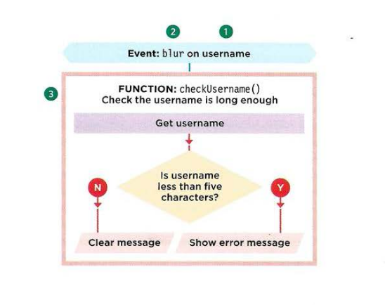

# EVENTS

When you browse the web, your browser registers different types of events. It's the browser's way of saying, `"Hey, this just happened."` Your script can then respond to these events.

## TERMINOLOGY

- **EVENTS FIRE OR ARE RAISED**: When an event has occurred, it is often described as having fired or been raised.
- **EVENTS TRIGGER SCRIPTS**: Events are said to trigger a function or script.

## DIFFERENT EVENT TYPES

Here is a selection of the events that occur in the browser while you are browsing the web. Any of these events can be used to trigger a function in your JavaScript code.

### UI events

Occur when a user interacts with the browser's user interface (UI) rather than the web page

| Event  | Description                                                     |
| ------ | --------------------------------------------------------------- |
| load   | Web page has finished loading                                   |
| unload | Web page is unloading (Usually because new page was registered) |
| error  | Browser encounter a JavaScript error or an asset don't exist    |
| resize | Browser window has been resized                                 |
| scroll | User has scrolled up or down the page                           |

### Keyboard events

Occur when a user interacts with the keyboard (see also input event)

| Event    | Description                                                  |
| -------- | ------------------------------------------------------------ |
| keydown  | User first presses a key (repeats while key is depressed)    |
| keyup    | User releases a key                                          |
| keypress | Character is being inserted (repeats while key is depressed) |

### MOUSE EVENTS

Occur when a user interacts with a mouse. trackpad, or touchscreen

| Event     | Description                                                    |
| --------- | -------------------------------------------------------------- |
| click     | User presses and releases a button over the same element       |
| dbclick   | User presses and releases a button twice over the same element |
| mousedown | User presses a mouse button while over an element              |
| mouseup   | User releases a mouse button while over an element             |
| mousemove | User moves the mouse (not on a touchscreen)                    |
| mouseover | User moves the mouse over an element (not on a touchscreen)    |
| mouseout  | User moves the mouse off an element (not on a touchscreen)     |

### FOCUS EVENTS

Occur when an element (e.g., a link or form field) gains or loses focus

| Event           | Description         |
| --------------- | ------------------- |
| focus / focusin | Element gains focus |
| blur / focusout | Element loses focus |

### FORM EVENTS

Occur when a user interacts with a form element.

| Event  | Description                                                                                                        |
| ------ | ------------------------------------------------------------------------------------------------------------------ |
| input  | Value in any \<input> or \<textarea> element has changed (IE9+) or any element with the content editable attribute |
| change | Value in select box, checkbox, or radio button changes (IE9+)                                                      |
| submit | User submits a form (using a button or a key)                                                                      |
| reset  | User clicks on a form's reset button (rarely used these days)                                                      |
| cut    | User cuts content from a form field                                                                                |
| copy   | User copies content from a form field                                                                              |
| paste  | User pastes content into a form field                                                                              |
| select | User selects some text in a form field                                                                             |

## HOW EVENT TRIGGER JAVASCRIPT CODE

When the user interacts with the HTML on a web page, there are three steps involved in getting it to trigger some JavaScript code. Together these steps are known as `event handling`.

1. Select the `element` node(s) you want the script to respond to.
2. Indicate which `event` on the selected node(s) will trigger the response.
3. State the `code` you want to run when the event occurs.

