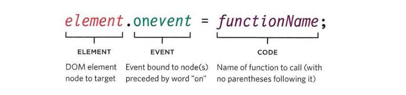
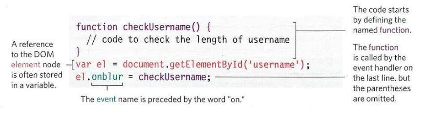
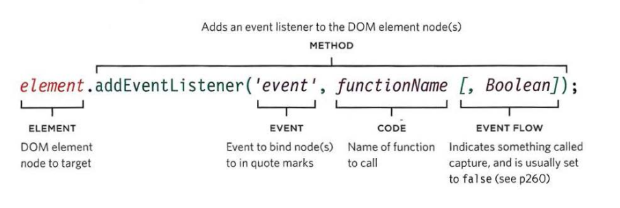
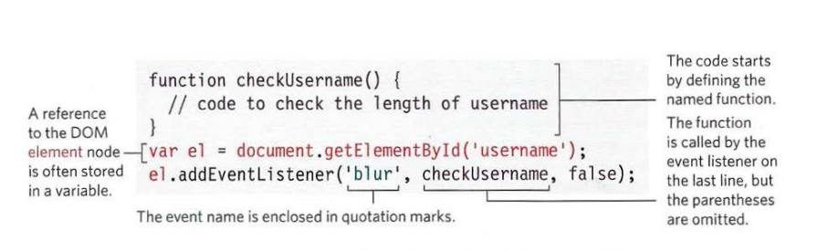
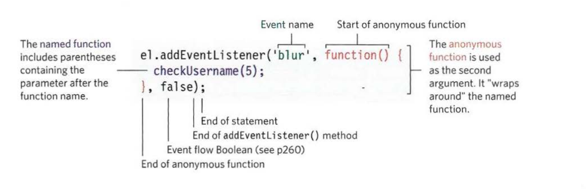
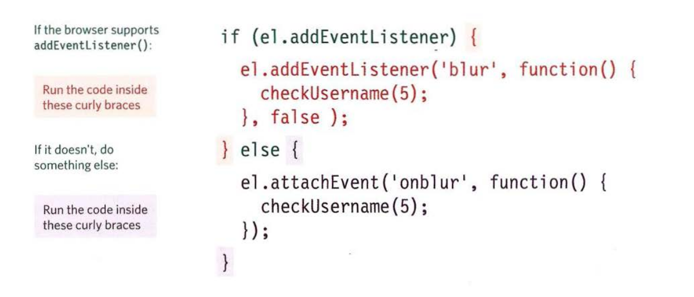

# THREE WAYS TO BIND AN EVENT TO AN ELEMENT

Event handlers let you indicate which event you are waiting for on any particular element. There are three types of event handlers.

1. HTML event handler (bad practice)
2. Traditional DOM event handlers.
3. DOM level 2 (event listeners)

### 1. HTML event handler (DO NOT USE)

example

**HTML**

```html
<!DOCTYPE html>
<html>
  <head>
    <title>
      JavaScript &amp; jQuery - Chapter 6: Events - Event Attributes
    </title>
    <link rel="stylesheet" href="css/c06.css" />
  </head>
  <body>
    <div id="page">
      <h1>List King</h1>
      <h2>New Account</h2>
      <form method="post" action="http://www.example.org/register">
        <label for="username">Create a username: </label>
        <input type="text" id="username" onblur="checkUsername()" />
        <div id="feedback"></div>

        <label for="password">Create a password: </label>
        <input type="password" id="password" />

        <input type="submit" value="sign up!" />
      </form>
    </div>
    <script src="js/event-attributes.js"></script>
  </body>
</html>
```

**JavaScript**

```js
function checkUsername() {
  // Declare function
  var elMsg = document.getElementById("feedback"); // Get feedback element
  var elUsername = document.getElementById("username"); // Get username input
  if (elUsername.value.length < 5) {
    // If username too short
    elMsg.textContent = "Username must be 5 characters or more"; // Set msg
  } else {
    // Otherwise
    elMsg.textContent = ""; // Clear message
  }
}
```

### 2. Traditional DOM event Handlers

All modern browsers understand this way of creating an event handler, but you can only attach one function to each event handler.





For the same html above we can make the javascript code like the following:

example found in **c6/js/event-handler.js**

**JavaScript**

```js
function checkUsername() {
  // Declare function
  var elMsg = document.getElementById("feedback"); // Get feedback element
  if (this.value.length < 5) {
    // If username too short
    elMsg.textContent = "Username must be 5 characters or more"; // Set msg
  } else {
    // Otherwise
    elMsg.textContent = ""; // Clear message
  }
}

var elUsername = document.getElementById("username"); // Get username input
elUsername.onblur = checkUsername; // When it loses focus call checkuserName()
```

### 3. DOM level 2 (event listeners)

Event listeners are a more recent approach to handling events. They can deal with more than one function at a time but they are not supported in older browsers.





example found in **c6/js/event-listener.js**

**JavaScript**

```js
function checkUsername() {
  // Declare function
  var elMsg = document.getElementById("feedback"); // Get feedback element
  if (this.value.length < 5) {
    // If username too short
    elMsg.textContent = "Username must be 5 characters or more"; // Set msg
  } else {
    // Otherwise
    elMsg.textContent = ""; // Clear msg
  }
}

var elUsername = document.getElementById("username"); // Get username input
// When it loses focus call checkUsername()
elUsername.addEventListener("blur", checkUsername, false);
```

## USING PARAMETERS WITH EVENT HANDLERS & listeners

Because you cannot have parentheses after the function names in event handlers or listeners, passing arguments requires a workaround. And for that we use something called `Anonymous function`.



example found in **c6/js/c05/js/event-listener-with-parameters.js.js**

```js
var elUsername = document.getElementById("username"); // Username input
var elMsg = document.getElementById("feedback"); // Error msg element

function checkUsername(minLength) {
  // Declare function
  if (elUsername.value.length < minLength) {
    // If username too short
    // Set the error message
    elMsg.innerHTML = "Username must be " + minLength + " characters or more";
  } else {
    // Otherwise
    elMsg.innerHTML = ""; // Clear msg
  }
}

elUsername.addEventListener(
  "blur",
  function() {
    // When it loses focus
    checkUsername(5); // Pass argument here
  },
  false
);
```

## SUPPORTING OLDER VERSIONS OF IE

IES-8 had a different event model and did not support `addEventListener()` but you can provide `fallback` code to make event listeners work with older versions of IE.



example found in **c6/js/event-listener-with-ie-fallback.js**

**JavaScript**

```js
var elUsername = document.getElementById("username"); // Get username input
var elMsg = document.getElementById("feedback"); // Get feedback element

function checkUsername(minLength) {
  // Declare function
  if (elUsername.value.length < minLength) {
    // If username too short
    // Set message
    elMsg.innerHTML = "Username must be " + minLength + " characters or more";
  } else {
    // Otherwise
    elMsg.innerHTML = ""; // Clear message
  }
}

if (elUsername.addEventListener) {
  // If event listener supported
  elUsername.addEventListener(
    "blur",
    function() {
      // When username loses focus
      checkUsername(5); // Call checkUsername()
    },
    false
  ); // Capture during bubble phase
} else {
  // Otherwise
  elUsername.attachEvent("onblur", function() {
    // IE fallback: on blur
    checkUsername(5); // Call checkUsername()
  });
}
```

### References and Terms:

> :information_source: [Anonymous function](https://en.wikipedia.org/wiki/Anonymous_function) is a function definition that is not bound to an identifier.
