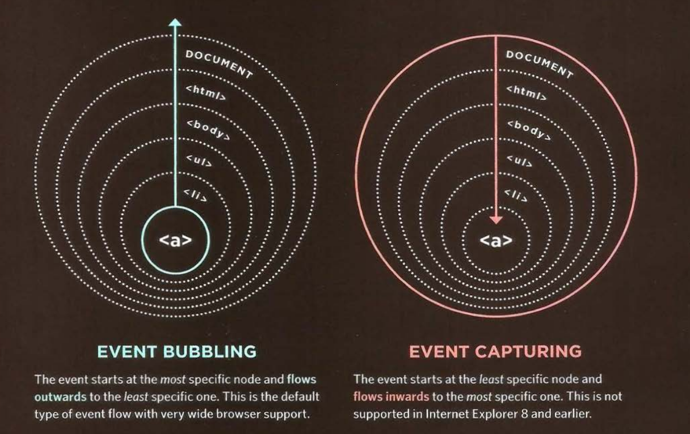

# EVENT FLOW

HTML elements nest inside other elements. If you hover or click on a link, you will also be hovering or clicking its parent elements.



# WHY FLOW MATTERS

The flow of events only really matters when your code has event handlers on an element and one of its grand element or grandson element.

**HTML**

```html
<div class="parent">
  <ul class="list">
    <li class="item">
      This is normal item
    </li>
  </ul>
</div>
```

**JavaScript**

```js
document.querySelector(".parent").addEventListener(
  "click",
  function() {
    alert("This is <div>");
  },
  false
);
document.querySelector(".list").addEventListener(
  "click",
  function() {
    alert("This is <ul>");
  },
  false
);
document.querySelector(".item").addEventListener(
  "click",
  function() {
    alert("This is <li>");
  },
  false
);
```

| Value | Phase     |
| ----- | --------- |
| false | Capturing |
| true  | Bubbling  |

Try to change from false to true and see what happen.
