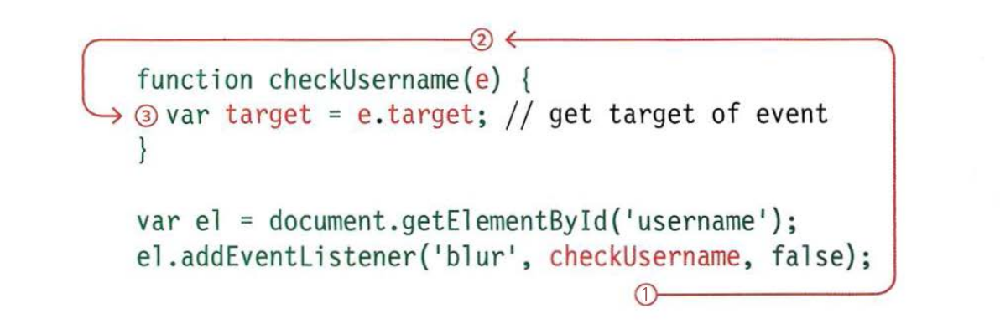
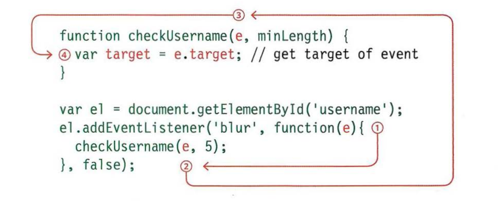

# THE EVENT OBJECT

When an event occurs, the event object tells you information about the event, and the element it happened upon.

Every time an event fires, the event object contains helpful data about the event, such as:

- Which element the event happened on.
- Which key was pressed for a `keypress` event.
- What part of the viewport the user clicked for a click event (the viewport is the part of the browser window that shows the web page).

Not only did IE8 have a different syntax for event listeners, the event object in IES-8 also had different names for the properties and methods shown in the tables below:

**As Properties**

| Property | IE5-8      | Description                                                     |
| -------- | ---------- | --------------------------------------------------------------- |
| target   | srcElement | The target of the event (most specific element interacted with) |
| type     | type       | Type of event that was fired                                    |
| etc...   | ---        | ---                                                             |

**As Methods**

| Method              | IE5-8        | Description                                            |
| ------------------- | ------------ | ------------------------------------------------------ |
| `preventDefault()`  | returnValue  | Cancel default behavior of the event                   |
| `stopPropagation()` | cancelBubble | Stops the event from bubbling or capturing any further |

Event object can be used in two ways

1. Event listener with no parameters
2. Event listener with parameters

### 1. EVENT LISTENER WITH NO PARAMETERS



### 2. EVENT LISTENER WITH PARAMETERS



**_Note that we are using event listener with no parameters_**

## THE EVENT OBJECT IN IE5-8

Below you can see how you get the event object in IES-8. It is not passed automatically to event handler/listener functions, but it is available as a child of the window object.

**JavaScript**

```js
function checkUsername(e) {
  if (!e) {
    e = window.event;
  }
}
```

### GETTING PROPERTIES WITH IE5-8

**JavaScript**

```js
var target;
(target = e), target || e.srcElement;
```

From previous code we can do a function that work as `cross-browser compatibility` function

**JavaScript**

```js
function getEventTarget(e) {
  if (!e) {
    e = window.event;
  }
  return e.target || e.srcElement;
}
```

example found in **c6/js/event-listener-with-event-object.js**

**JavaScript**

```js
function checkLength(e, minLength) {
  // Declare function
  var el, elMsg; // Declare variables
  if (!e) {
    // If event object doesn't exist
    e = window.event; // Use IE fallback
  }
  el = e.target || e.srcElement; // Get target of event
  elMsg = el.nextSibling; // Get its next sibling

  if (el.value.length < minLength) {
    // If length is too short set msg
    elMsg.innerHTML = "Username must be " + minLength + " characters or more";
  } else {
    // Otherwise
    elMsg.innerHTML = ""; // Clear message
  }
}

var elUsername = document.getElementById("username"); // Get username input
if (elUsername.addEventListener) {
  // If event listener supported
  elUsername.addEventListener(
    "blur",
    function(e) {
      // On blur event
      // NOTE: This function is checkLength() - not checkUsername()
      checkLength(e, 5); // Call checkLength()
    },
    false
  ); // Capture in bubble phase
} else {
  // Otherwise
  elUsername.attachEvent("onblur", function(e) {
    // IE fallback onblur
    // NOTE: This function is checkLength() - not checkUsername()
    checkLength(e, 5); // Call checkLength()
  });
}
```

### References and Terms:

> :information_source: [cross-browser compatibility](https://en.wikipedia.org/wiki/Cross-browser_compatibility) is the ability of a website or web application to function across different browsers.
