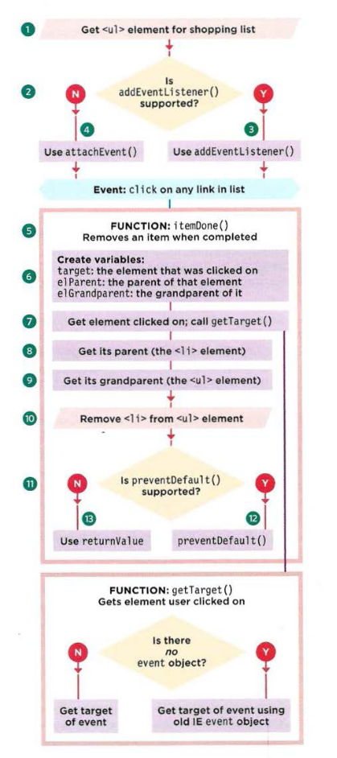
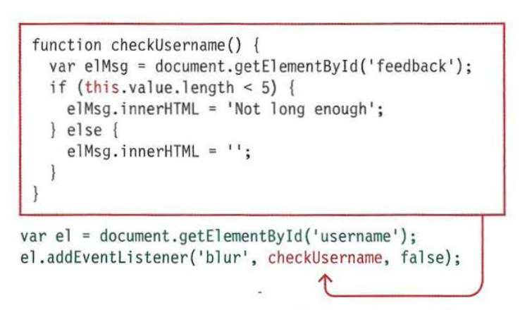
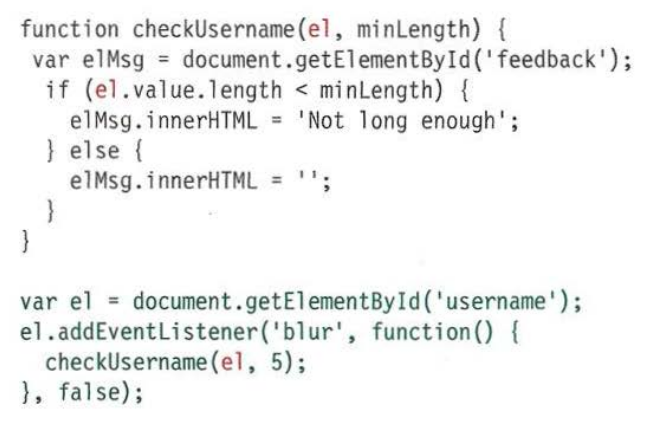

# EVENT DELEGATION

Creating event listeners for a lot of elements can slow down a page, but event flow allows you to listen for an event on a parent element.

User can interact with a lot of elements on the page, such as:

- a lot of buttons in the UI.
- a long list.
- every cell of a table.

## USING EVENT DELEGATION

This example w ill put together a lot of what you have learned in the chapter so far. Each list item contains a link. When the user clicks on that link (to indicate they have completed that task), the item will be removed from the list.

From the following example flowchart we can implement our code accordingly



example found in **c6/js/event-delegation.html**

**HTML**

```html
<!DOCTYPE html>
<html>
  <head>
    <title>
      JavaScript &amp; jQuery - Chapter 6: Events - Event Delegation
    </title>
    <link rel="stylesheet" href="css/c06.css" />
  </head>
  <body>
    <div id="page">
      <h1>List King</h1>
      <h2>Buy groceries</h2>
      <ul id="shoppingList">
        <li class="complete">
          <a href="itemDone.php?id=1"><em>fresh</em> figs</a>
        </li>
        <li class="complete"><a href="itemDone.php?id=2">pine nuts</a></li>
        <li class="complete"><a href="itemDone.php?id=3">honey</a></li>
        <li class="complete">
          <a href="itemDone.php?id=4">balsamic vinegar</a>
        </li>
      </ul>
    </div>
    <script src="js/event-delegation.js"></script>
  </body>
</html>
```

**JavaScript**

```js
function getTarget(e) {
  // Declare function
  if (!e) {
    // If there is no event object
    e = window.event; // Use old IE event object
  }
  return e.target || e.srcElement; // Get the target of event
}

function itemDone(e) {
  // Declare function
  // Remove item from the list
  var target, elParent, elGrandparent; // Declare variables
  target = getTarget(e); // Get the item clicked link
  elParent = target.parentNode; // Get its list item
  elGrandparent = target.parentNode.parentNode; // Get its list
  elGrandparent.removeChild(elParent); // Remove list item from list

  // Prevent the link from taking you elsewhere
  if (e.preventDefault) {
    // If preventDefault() works
    e.preventDefault(); // Use preventDefault()
  } else {
    // Otherwise
    e.returnValue = false; // Use old IE version
  }
}

// Set up event listeners to call itemDone() on click
var el = document.getElementById("shoppingList"); // Get shopping list
if (el.addEventListener) {
  // If event listeners work
  el.addEventListener(
    "click",
    function(e) {
      // Add listener on click
      itemDone(e); // It calls itemDone()
    },
    false
  ); // Use bubbling phase for flow
} else {
  // Otherwise
  el.attachEvent("onclick", function(e) {
    // Use old IE model: onclick
    itemDone(e); // Call itemDone()
  });
}
```

## WHICH ELEMENT DID AN EVENT OCCUR ON

When calling a function, the event object's target property is the best way to determine which element the event occurred on. But you may see the approach below used, it relies on the `this` keyword.

- Using `this` keyowrd:



- Using parameters


