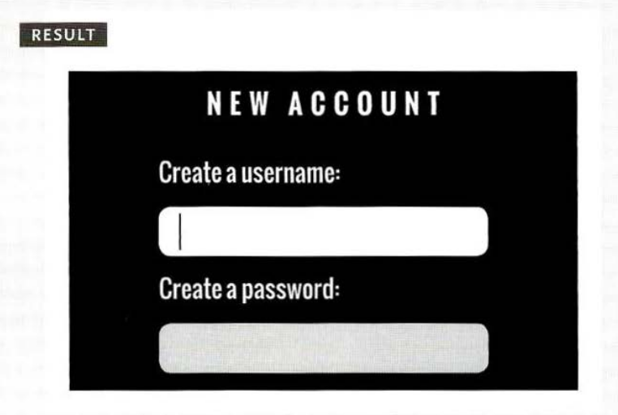
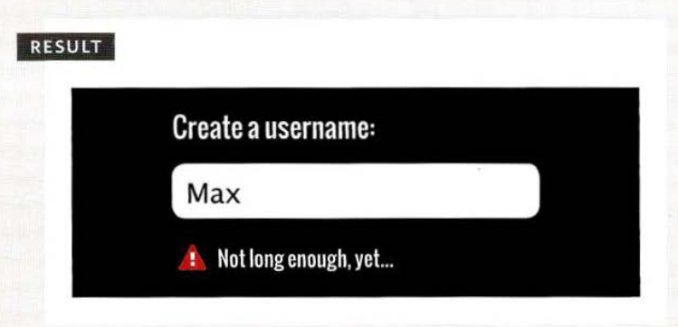
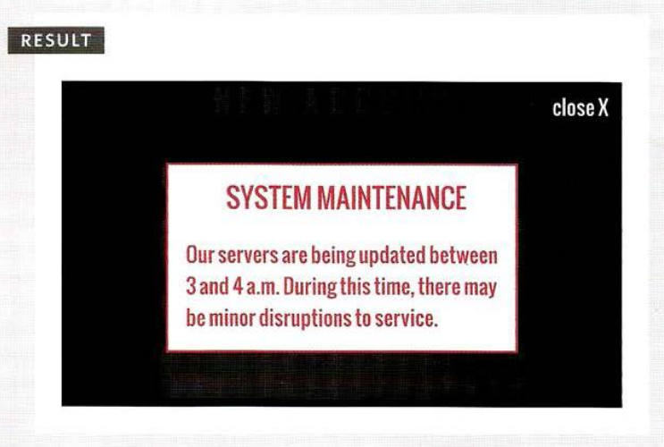
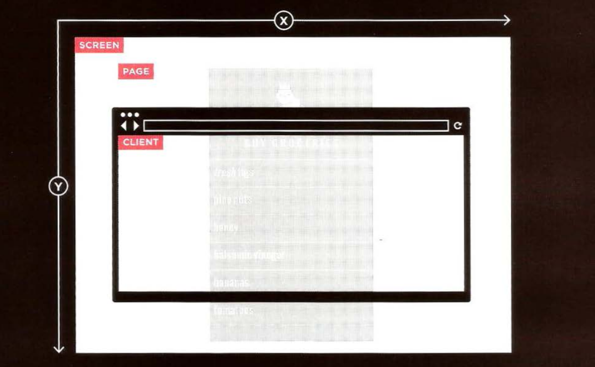
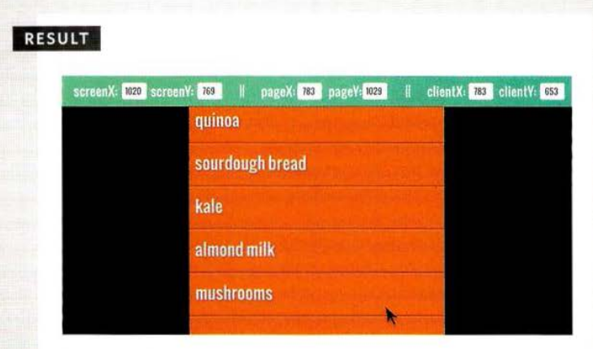
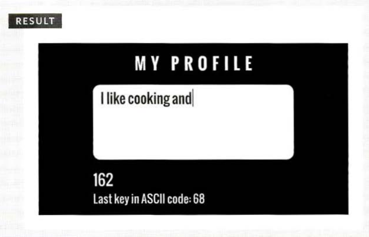

# USER INTERFACE events

User interface (UI) events occur as a result of interaction with the browser window rather than the HTML page contained within it, e.g., a page having loaded or the browser window being resized.

| Event  | Description                                                                                                                                                           |
| ------ | --------------------------------------------------------------------------------------------------------------------------------------------------------------------- |
| load   | Fires when the web page has finished loading. lt can also fire on nodes of other elements that load, such as images, scripts, or objects.                             |
| unload | Fires when the web page is unloading (usually because a new page has been requested).                                                                                 |
| error  | Fires when the browser encounters a JavaScript error or an asset doesn't exist.                                                                                       |
| resize | Fires when the browser window has been resized.                                                                                                                       |
| scroll | Fires when the user has scrolled up or down the page. It can relate to the entire page or a specific element on the page (such as a \<textarea> that has scrollbars). |

## 1. LOAD Event

example found in **c6/js/load.js**

**JavaScript**

```js
function setup() {
  // Declare function
  let textInput; // Create variable
  textInput = document.getElementById("username"); // Get username input
  textInput.focus(); // Give username focus
}

window.addEventListener("load", setup, false); // When page loaded call setup()

/* LONGER VERSION WITH IE8 (and lower) compatibility

if (el.addEventListener) {
  el.addEventListener('focus', tipUsername, false);
  el.addEventListener('blur', checkUsername, false);
} else {
  el.attachEvent('onfocus', tipUsername);
  el.attachEvent('onblur', checkUsername);
}
```



## 2. FOCUS & BLUR EVENTS

The HTML elements you can interact with, such as links and form elements, can gain focus. These events fire when they gain or lose focus.

example found in **c6/js/focus-blur.js**

**JavaScript**

```js
function checkUsername() {
  // Declare function
  var username = el.value; // Store username in variable
  if (username.length < 5) {
    // If username < 5 characters
    elMsg.className = "warning"; // Change class on message
    elMsg.textContent = "Not long enough, yet..."; // Update message
  } else {
    // Otherwise
    elMsg.textContent = ""; // Clear the message
  }
}

function tipUsername() {
  // Declare function
  elMsg.className = "tip"; // Change class for message
  elMsg.innerHTML = "Username must be at least 5 characters"; // Add message
}

var el = document.getElementById("username"); // Username input
var elMsg = document.getElementById("feedback"); // Element to hold message

// When the username input gains / loses focus call functions above:
el.addEventListener("focus", tipUsername, false); // focus call tipUsername()
el.addEventListener("blur", checkUsername, false); // blur call checkUsername()

/* LONGER VERSION WITH IE8 (and lower) compatibility

if (el.addEventListener) {
  el.addEventListener('focus', tipUsername, false);
  el.addEventListener('blur', checkUsername, false);
} else {
  el.attachEvent('onfocus', tipUsername);
  el.attachEvent('onblur', checkUsername);
}

*/
```



## 3. MOUSE EVENTS

The mouse events are fired when the mouse is moved and also when its buttons are clicked.

| Event     | Description                                                    |
| --------- | -------------------------------------------------------------- |
| click     | User presses and releases a button over the same element       |
| dbclick   | User presses and releases a button twice over the same element |
| mousedown | User presses a mouse button while over an element              |
| mouseup   | User releases a mouse button while over an element             |
| mousemove | User moves the mouse (not on a touchscreen)                    |
| mouseover | User moves the mouse over an element (not on a touchscreen)    |
| mouseout  | User moves the mouse off an element (not on a touchscreen)     |

### CLICK

example found in **c6/js/click.js**

**JavaScript**

```js
// Create the HTML for the message
var msg = '<div class="header"><a id="close" href="#">close X</a></div>';
msg += "<div><h2>System Maintenance</h2>";
msg += "Our servers are being updated between 3 and 4 a.m. ";
msg += "During this time, there may be minor disruptions to service.</div>";

var elNote = document.createElement("div"); // Create a new element
elNote.setAttribute("id", "note"); // Add an id of note
elNote.innerHTML = msg; // Add the message
document.body.appendChild(elNote); // Add it to the page

function dismissNote() {
  // Declare function
  document.body.removeChild(elNote); // Remove the note
}

var elClose = document.getElementById("close"); // Get the close button
elClose.addEventListener("click", dismissNote, false); // Click close-clear note
```



### WHERE EVENTS OCCUR (Related to mouse event)

The `event object` can tell you where the user cursor was positioned when an event was triggered.



Controlling mouse position is determined according to:

- SCREEN:
  `screenX`, `screenY` properties indicate the position of the cursor within the entire screen on your monitor, measuring from the top left corner of the screen (YOUR MONITOR).
- PAGE
  The `pageX`, `pageY` properties indicate the position of the cursor within the entire page. The top of the page may be outside of the viewport so even if the cursor is in the same position, page and client coordinates can be different.
- CLIENT
  The `clientX`, `clientY` properties indicate the position of the cursor within the browser viewport. If the user jas scrolled down and the top of the page is no longer in the view, it will not affect the client coordinates.

### DETERMINING POSITION

example found in **c6/js/position.js**

**JavaScript**

```js
var sx = document.getElementById("sx"); // Element to hold screenX
var sy = document.getElementById("sy"); // Element to hold screenY
var px = document.getElementById("px"); // Element to hold pageX
var py = document.getElementById("py"); // Element to hold pageY
var cx = document.getElementById("cx"); // Element to hold clientX
var cy = document.getElementById("cy"); // Element to hold clientY

function showPosition(event) {
  // Declare function
  sx.value = event.screenX; // Update element with screenX
  sy.value = event.screenY; // Update element with screenY
  px.value = event.pageX; // Update element with pageX
  py.value = event.pageY; // Update element with pageY
  cx.value = event.clientX; // Update element with clientX
  cy.value = event.clientY; // Update element with clientY
}

var el = document.getElementById("body"); // Get body Element
el.addEventListener("mousemove", showPosition, false); // Move updates position
```



## KEYBOARD EVENTS

The keyboard events are fired when a user interacts with the keyboard (they fire on any kind of device with a keyboard).

| Event    | Description                                                         |
| -------- | ------------------------------------------------------------------- |
| Input    | Fires when the value of an \<input> or \<textarea> element changes. |
| keydown  | User first presses a key (repeats while key is depressed)           |
| keyup    | User releases a key                                                 |
| keypress | Character is being inserted (repeats while key is depressed)        |

In the following example found in **c6/js/keypress.js** which can tell us about key pressed `keyCode` or `ASCII code`.

**JavaScript**

```js
var el; // Declare variables

function charCount(e) {
  // Declare function
  var textEntered, charDisplay, counter, lastkey; // Declare variables
  textEntered = document.getElementById("message").value; // User's text
  charDisplay = document.getElementById("charactersLeft"); // Counter element
  counter = 180 - textEntered.length; // Num of chars left
  charDisplay.textContent = counter; // Show chars left

  lastkey = document.getElementById("lastKey"); // Get last key used
  lastkey.textContent = "Last key in ASCII code: " + e.keyCode; // Create msg
}
el = document.getElementById("message"); // Get msg element
el.addEventListener("keypress", charCount, false); // keypress -call charCount()
```



## FORM EVENTS

There are two events that are commonly used with forms. In particular you are likely to see submit used in form validation.

| Event  | Description                                                                                                        |
| ------ | ------------------------------------------------------------------------------------------------------------------ |
| input  | Value in any \<input> or \<textarea> element has changed (IE9+) or any element with the content editable attribute |
| change | Value in select box, checkbox, or radio button changes (IE9+)                                                      |
| submit | User submits a form (using a button or a key)                                                                      |
| reset  | User clicks on a form's reset button (rarely used these days)                                                      |
| cut    | User cuts content from a form field                                                                                |
| copy   | User copies content from a form field                                                                              |
| paste  | User pastes content into a form field                                                                              |
| select | User selects some text in a form field                                                                             |

example found in **c6/js/form.js**

**JavaScript**

```js
var elForm, elSelectPackage, elPackageHint, elTerms, elTermsHint; // Declare variables
elForm = document.getElementById("formSignup"); // Store elements
elSelectPackage = document.getElementById("package");
elPackageHint = document.getElementById("packageHint");
elTerms = document.getElementById("terms");
elTermsHint = document.getElementById("termsHint");

function packageHint() {
  // Declare function
  var package = this.options[this.selectedIndex].value; // Get selected option
  if (package === "monthly") {
    // If monthly package
    elPackageHint.innerHTML = "Save $10 if you pay for 1 year!"; //Show this msg
  } else {
    // Otherwise
    elPackageHint.innerHTML = "Wise choice!"; // Show this message
  }
}

function checkTerms(event) {
  // Declare function
  if (!elTerms.checked) {
    // If checkbox ticked
    elTermsHint.innerHTML = "You must agree to the terms."; // Show message
    event.preventDefault(); // Don't submit form
  }
}

//Create event listeners: submit calls checkTerms(), change calls packageHint()
elForm.addEventListener("submit", checkTerms, false);
elSelectPackage.addEventListener("change", packageHint, false);
```

---

### References and Terms:

> :information_source: [ASCII](https://www.cs.cmu.edu/~pattis/15-1XX/common/handouts/ascii.html) stands for American Standard Code for Information Interchange.
