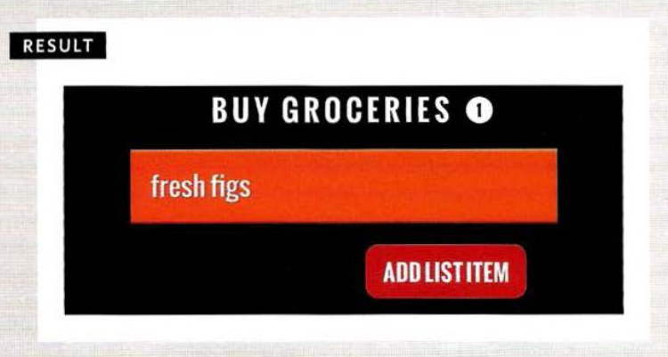

# MUTATION EVENTS & OBSERVABLES

Whenever elements are added to or removed from the DOM, its structure changes. This change triggers a mutation event.

| Event                       | Description                                                                                                       |
| --------------------------- | ----------------------------------------------------------------------------------------------------------------- |
| DOMNodeInserted             | Fires when a node is inserted into the DOM tree. e.g. using `appendChild()`, `replaceChild`, or `insertBefore()`. |
| DOMNodeRemoved              | Fires when a node is removed from the DOM tree. e.g. using `removeChild()` or `replaceChild()`.                   |
| DOMSubtreeModified          | Fires when the DOM structure changes. It fires after the two events listed above occur.                           |
| DOMNodeInsertedIntoDocument | Fires when a node is inserted into the DOM tree as a descendant of another node that is already in the document.  |
| DOMNodeRemovedFromDocument  | Fires when a node is removed from the DOM tree as a descendant of another node that is already in the document.   |

**Problems with Mutation events:**

If your script makes a lot of changes to a page, you end up with a lot of mutation event firing. This can
make a page feel slow or unresponsive.

example found in **c6/js/mutation.js**

**JavaScript**

```js
var elList, addLink, newEl, newText, counter, listItems; // Declare variables

elList = document.getElementById("list"); // Get list
addLink = document.querySelector("a"); // Get add item button
counter = document.getElementById("counter"); // Get item counter

function addItem(e) {
  // Declare function
  e.preventDefault(); // Prevent link action
  newEl = document.createElement("li"); // New <li> element
  newText = document.createTextNode("New list item"); // New text node
  newEl.appendChild(newText); // Add text to <li>
  elList.appendChild(newEl); // Add <li> to list
}

function updateCount() {
  // Declare function
  listitems = list.getElementsByTagName("li").length; // Get total of <li>s
  counter.innerHTML = listitems; // Update counter
}

addLink.addEventListener("click", addItem, false); // Click on button
elList.addEventListener("DOMNodeInserted", updateCount, false); // DOM updated
```


