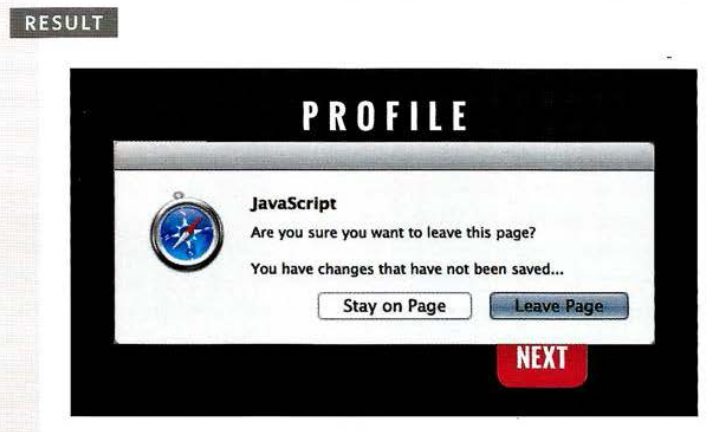

# HTML5 EVENTS

Here are three page-level events that have been included in versions of the HTML5 spec that have become popular very quickly.

| Event            | Description                                                                                                                                                                                                                                                                                                                                                                                                 |
| ---------------- | ----------------------------------------------------------------------------------------------------------------------------------------------------------------------------------------------------------------------------------------------------------------------------------------------------------------------------------------------------------------------------------------------------------- |
| DOMContentLoaded | Event fires when the DOM tree is formed (images, CSS, and JavaScript might still be loading). Scripts start to run earlier than using the load event which waits for other resources such as images and advertisements to load. This makes the page seem faster to load.                                                                                                                                    |
| hashchange       | Event fires when the URL hash changes (without the entire window refreshing). Hashes are used on links to specific parts (sometimes known as anchors) within a page and also on pages that use AJAX to load content. The hashchange event handler works on the window object, and after firing, the event object will have old URL and newURL properties that hold the url before and after the hashchange. |
| beforeunload     | Event fires on the window object before the page is unloaded. It should only be used to help the user (not to encourage them to stay on a website if they are trying to leave).                                                                                                                                                                                                                             |

example found in **c6/js/html5-events.js**

**JavaScript**

```js
function setup() {
  var textInput;
  textInput = document.getElementById("message");
  textInput.focus();
}

window.addEventListener("DOMContentLoaded", setup, false);

window.addEventListener("beforeunload", function(event) {
  // This example has been updated to improve cross-browser compatibility (as recommended by MDN)
  var message = "You have changes that have not been saved";
  (event || window.event).returnValue = message;
  return message;
});
```


