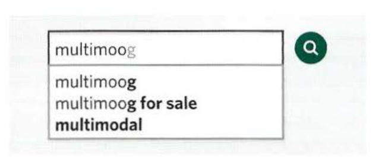

# AJAX AND JSON

Ajax is a technique for loading data into part of a page without having to refresh the entire page. The data is often sent in a format called JavaScript Object Notation (or JSON).

## WHAT IS AJAX

You may have seen Ajax used on many websites, even if you were not aware that it was being used.

Live search (or autocomplete) commonly uses Ajax. You may have seen it used on the Google website.

## WHY WE USE AJAX

Ajax uses an `asynchronous` processing model. This means the user can do other things while the web browser is waiting for the data to load, speeding up the user experience.

### Using AJAX while pages are loading:

When a browser comes across a `<script>` tag, it will Once a page has loaded, if you want to update what typically stop processing the rest of the page until it has loaded and processed that script. This is known as a `synchronous processing model`.

When a page is loading, if a script needs to collect data from a server, then the browser
would not just wait for the script to be loaded and processed, it would also have to wait for a server to send the data that the script is going to display.

With `Ajax`, the browser can request some data from a server and once that data has been requested, continue to load the rest of the page and process the user's interactions with the page. It is known as an `asynchronous (or non-blocking) processing model`.

### Using AJAX when pages have loaded:

Once a page has loaded, if you want to update what the user sees in the browser window, typically you would refresh the entire page. This means that the user has to wait for a whole new page to download and be rendered by the browser.

With `Ajax`, if you only want to update a part of the page, you can just update the content of one element. This is done by intercepting an event (such
as the user clicking on a link or submitting a form) and requesting the new content from the server using an asynchronous request.

While t hat data is loading, the user can continue to interact w ith the rest of the page. Then, once the server has responded, a special Ajax event will trigger another part of the script that reads the new data from the server and updates just that one part of the page.

## HOW AJAX WORKS

When using Ajax, the browser requests information from a web server. It then process the server's response and shows it within the page.

