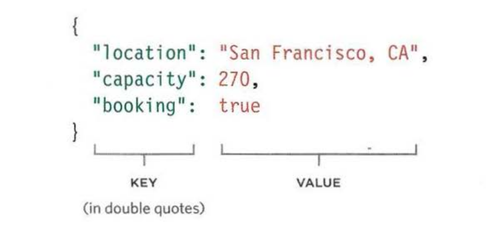

# JSON

Data can be formatted using JSON (pronounced "Jason"). It looks very similar to object literal syntax, but it is not an object.



## KEYS CONDITIONS

1. In JSON, the keys should be in `double quoted`. (NOT A SINGLE QUOTE!!!).
2. Key name is separated from its value by colon.
3. Each (key/value) pair is separated by a comma.

## VALUES

The value can be any of the following data type:

| Data type | Description                                                 |
| --------- | ----------------------------------------------------------- |
| `string`  | Text (Must be written in quotes)                            |
| `number`  | Number                                                      |
| `Boolean` | Either `true`, `false`                                      |
| `array`   | Array of value - This can be any array of objects           |
| `object`  | JavaScript object - This can contain child objects or array |
| `null`    | This is when the value is empty or missing                  |

## WORKING WITH JSON Data

JavaScript's JSON object can turn JSON data into a JavaScript object. It can also convert a JavaScript object into a string.

**JavaScript JSON**

```js
{
    "json": [
        {
            "userId": 1,
            "id": 1,
            "title": "sunt aut facere repellat provident occaecati excepturi optio reprehenderit",
            "body": "quia et suscipit\nsuscipit recusandae consequuntur expedita et cum\nreprehenderit molestiae ut ut quas totam\nnostrum rerum est autem sunt rem eveniet architecto",
            "private": false,
            "expire": null
        },
        {
            "userId": 1,
            "id": 2,
            "title": "qui est esse",
            "body": "est rerum tempore vitae\nsequi sint nihil reprehenderit dolor beatae ea dolores neque\nfugiat blanditiis voluptate porro vel nihil molestiae ut reiciendis\nqui aperiam non debitis possimus qui neque nisi nulla",
            "private": false,
            "expire": null
        },
        {
            "userId": 1,
            "id": 3,
            "title": "ea molestias quasi exercitationem repellat qui ipsa sit aut",
            "body": "et iusto sed quo iure\nvoluptatem occaecati omnis eligendi aut ad\nvoluptatem doloribus vel accusantium quis pariatur\nmolestiae porro eius odio et labore et velit aut",
            "private": false,
            "expire": null
        }
    ]
}
```

JavaScript provide us with two powerful methods which are part of our built in object of `window`:

1. `JSON.stringify()` Convert javascript object into a string.
2. `JSON.parse()` convert JSON data into javascript object.
