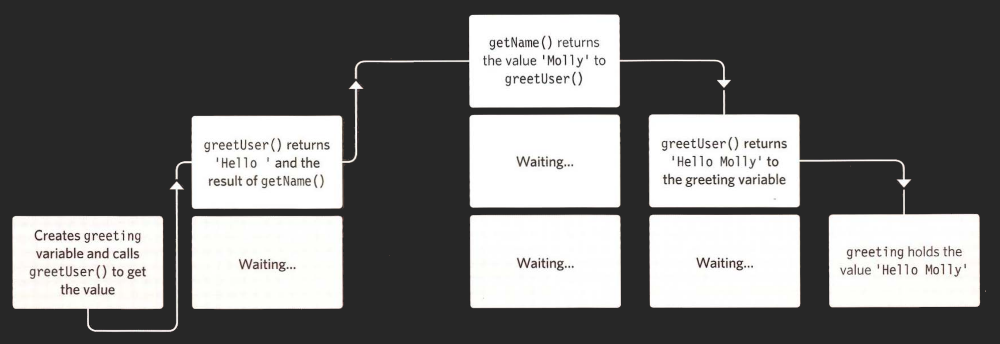

# ERROR HANDLING AND DEBUGGING

JavaScript can be hard to learn and everyone makes mistakes when writing it. This chapter will help you learn how to find the errors in your code. It will also teach you how to write scripts that deal with potential errors gracefully.

## ORDER OF EXECUTION

To find the source of an error, it helps to know how scripts are processed. The order in which statements are executed can be complex, some tasks cannot complete until another statement or function has been run.


As we can see the execution is not as expected.

## EXECUTION CONTEXTS

The JavaScript `interpreter` uses the concept of execution contexts. There is one global execution context. plus, each function creates a new execution context. They correspond to variable scope.

Execution context are:

- Global context.

  - Code that is in the script, but not in a function. There is only one global context in any page.

- Functional context.

  - Code that is being run within a function. Each function has its own function context.

- Eval context (NOT TAKEN. Use with precaution "Better not").
  - Text is executed like code in an internal function called `eval()`.

## THE STACK

The JavaScript interpreter processes one line of code at a time. When a statement needs data from another function, it stacks the new function on top of the current task.

**JavaScript**

```js
function greetUser() {
  return "Hello " + getUser();
}
function getName() {
  var name = "Molly";
  return name;
}

var greeting = greetUser();
alert(greeting);
```



## EXECUTION CONTEXT & HOISTING

Each time a script enters a new execution context, there are two phases of activity.

1. PREPARE

- The new scope is created.
- Variables, functions, and arguments are created.
- The value of `this` keyword is determined.

2. EXECUTE

- Now it can assign values to variables.
- Reference functions and run their code.
- Execute statements.

Understanding these two phases, helps with understanding a concept called **_`Hoisting`_**. To understand what `hoisting` is meaning let us see the following examples:

**JavaScript**

```js
let greeting = greetUser();
function greetUser() {
  // Create greeting here.
}
```

It works because the function and first statement are in the same execution context, so it is treated like this:

```js
function greetUser() {
  // Create greeting here.
}
let greeting = greetUser();
```

BUT the following code will fail because `greetUser()` is created within the `getName()` function's context, or you can say (Private scope).

**JavaScript**

```js
let greeting = greetUser();
function getName() {
  function greetUser() {
    // Create greeting here.
  }
  // Return name with greeting.
}
```

## UNDERSTANDING SCOPE

In the interpreter, each execution context has its own variables object. It holds the variables, functions, and parameters available within it. Each execution context can also access its parent's variables object.

access its parent's variables object called `(Closure)`;

Check this example:

**JavaScript**

```js
let greeting = (function() {
  let d = new Date();
  let time = d.getHours();
  let greeting = greetUser();

  function greetUser() {
    if (time < 12) {
      let msg = 'Good morning ';
    } else {
      let msg = 'Welcome ';
    }
    return = msg + getName();
  }
  function getName() {
    var name = 'John Wich';
    return name;
  }
})
```


`Private scope` called also `lexical scope`;

---

### References and Terms:

> :information*source: [interpreter](https://en.wikipedia.org/wiki/Interpreter*(computing)) is a computer program that directly executes, i.e. performs instructions written in a programming or scripting language, without requiring them previously to have been compiled into a machine language program.
