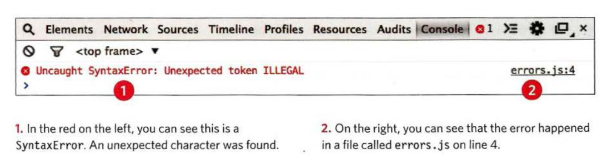

# UNDERSTANDING ERRORS

If a JavaScript statement generates an error, then it throws an `exception`. At that point, the `interpreter` stops and looks for `exception-handling` code.

## ERROR OBJECTS

Error objects can help you find where your mistakes are and browsers have tools to help you read them.

| Property   | Description                 |
| ---------- | --------------------------- |
| name       | Type of execution           |
| message    | Description                 |
| fileNumber | Name of the JavaScript file |
| lineNumber | Line number of error        |



There are seven types of built-in error objects in JavaScript.

| Object         | Description                                                       |
| -------------- | ----------------------------------------------------------------- |
| Error          | Generic error - the other errors are all based upon this error    |
| SyntaxError    | Syntax has not been followed                                      |
| ReferenceError | Tried to reference a variable that is not declared/within scope   |
| TypeError      | An unexpected data type that cannot be coerced                    |
| RangeError     | Numbers not in acceptable range                                   |
| URIError       | `encodeURI()`, `decodeURI()`,and similar methods used incorrectly |
| EvalError      | `eval()` function used incorrectly                                |

## EXAMINE ERROR OBJECTS

Please note that these error messages are from the Chrome browser. Other browsers' error messages may vary.

1. **SyntaxError** SYNTAX IS NOT CORRECT
   This is caused by incorrect use of the rules of the language. It is often the result of a simple typo.

| Error           | Description                    | Chrome message                                               | Example of Error                                      |
| --------------- | ------------------------------ | ------------------------------------------------------------ | ----------------------------------------------------- |
| **SyntaxError** | MISMATCHING OR UNCLOSED QUOTES | SyntaxError: Unexpected EOF                                  | `console.log("Error');`                               |
| **SyntaxError** | MISSING CLOSING BRACKET        | SyntaxError: Expected token ')'                              | `console.log("Error"`                                 |
| **SyntaxError** | MISSING COMMA IN ARRAY         | SyntaxError: Expected token ']'                              | `let list = ["item 1", "item 2" "item 3"]`            |
| **SyntaxError** | MALFORMED PROPERTY NAME        | SyntaxError: Expected an identifier but found 'name' instead | `let user = { first name: "John", lastName: "Wick"};` |

2. **ReferenceError** VARIABLE DOES NOT EXIST
   This is caused by a variable that is not declared or is out of scope.

| Error              | Description                 | Chrome message                                      | Example of Error                             |
| ------------------ | --------------------------- | --------------------------------------------------- | -------------------------------------------- |
| **ReferenceError** | VARIABLE IS UNDECLARED      | ReferenceError: Can't find variable: height         | `let width = 12; let area = width * height;` |
| **ReferenceError** | NAMED FUNCTION IS UNDEFINED | ReferenceError: Can't find variable: randomFunction | `randomFunction();`                          |

2. **URIError** INCORRECT USE OF URI FUNCTIONS
   If these characters are not escaped in URls, they will cause an error: `/ ? & I :` ;

| Error        | Description            | Chrome message       | Example of Error                                        |
| ------------ | ---------------------- | -------------------- | ------------------------------------------------------- |
| **URIError** | VARIABLE IS UNDECLARED | URlError : URI error | `decodeURIComponent('http://bbc.com/news.php%3|Fa=l');` |

## EXAMPLES OF ERRORS

1. TypeError

```js
Document.querySelector("name");
/**
 * TypeError: 'undefined' is not a function (evaluating 'Document.querySelector('name')')
 */
```

```js
document.QuerySelector("name");
/**
 * TypeError: 'undefined' is not a function (evaluating 'document.QuerySelector('name')')
 */
```

```js
var box = {};
box.getArea();
/**
 * TypeError: 'undefined ' is not a function (evaluating 'box.getArea()')
 */
```

```js
var el = document.getElementById("z");
el.innerHTML = "Mango";
/**
 * TypeError: 'null' is not an object (evaluating 'el.innerHTML = 'Mango'')
 */
```

2. RangeError

```js
var anArray = new Array(-1);
/**
 * RangeError : Array size is not a small enough positive integer
 */
```

```js
var price = 9.99;
price.toFixed(21);
/**
 * RangeError: toFixed() argument must be between 0 and 20
 */
```

```js
num = 2.3456;
num.toPrecision(22);
/**
 * RangeError: toPrecision() argument must be between 1 and 21
 */
```

3. NaN
   `NOT AN ERROR` If you perform a mathematical operation using a value that is not a number, you end up with the value of NaN, not a type error.

### References and Terms:

> :information_source: [interpreter](<https://en.wikipedia.org/wiki/Interpreter_(computing)>) is a computer program that directly executes, i.e. performs instructions written in a programming or scripting language, without requiring them previously to have been compiled into a machine language program.
