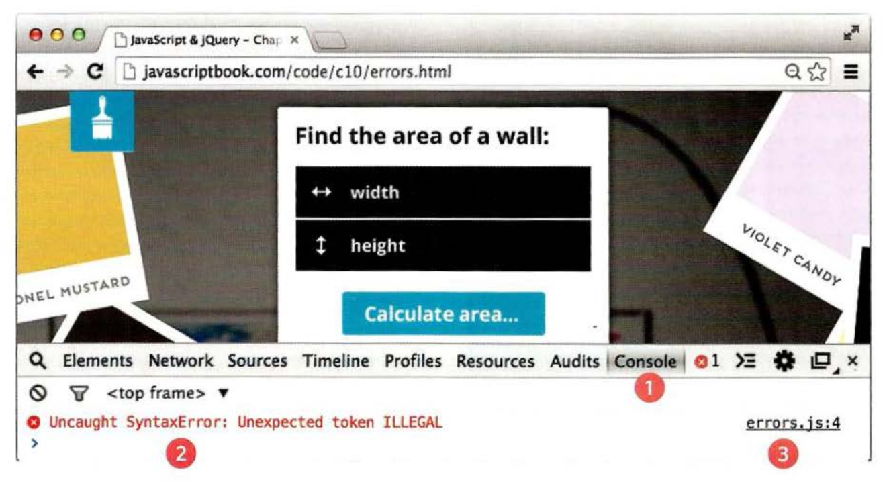
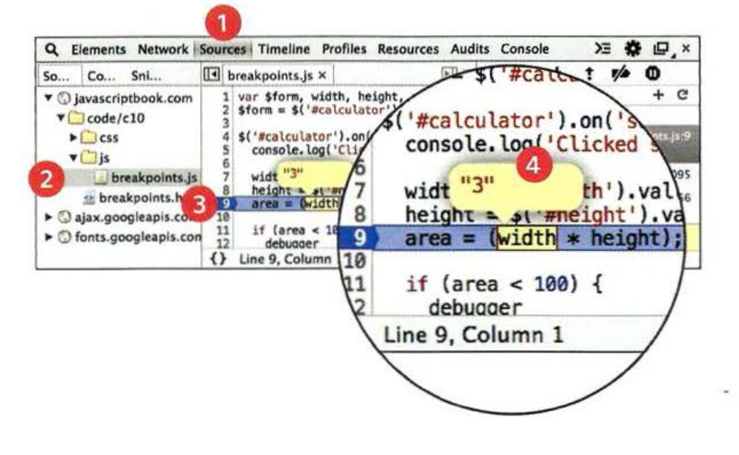

# HOW TO DEAL WITH ERRORS

Now that you know what an error is and how the browser treats them, there are two things you can do with the errors.

1. DEBUG THE SCRIPT TO FIX ERRORS.
2. HANDLE ERRORS GRACEFULLY (by using `tray .. catch .. throw .. finally` statements).

## 1. A DEBUGGING WORKFLOW

By trying to narrow down where the problem might be, then look for clues. By following those steps you can investigate your error.

`A. WHERE IS THE PROBLEM?`

1. Look at the error message, it tells you:
   - The relevant script that caused the problem.
   - The line number where it became a problem for the interpreter.
   - The type of error.
2. Check how far the script is running.
3. Use breakpoints where things are going wrong.

`B. WHAT EXACTLY IS THE PROBLEM?`
Once you think that you might know the rough area in which your problem is located, you can then try to find the actual line of code that is causing the error.

1. When you have set breakpoints, you can see if the variables around them have the values you would expect them to.
2. Break down/break out parts of the code to test smaller pieces of the functionality.
   - Write values of variables into the `console`.
   - Call functions from the console to check if they are returning what you would expect them to.
   - Check if objects exist and have the methods/properties that you think they do.
3. Check the number of parameters for a function, or the number of items in an array.

## HOW TO LOOK AT ERRORS IN CHROME

The console will show you when there is an error in your JavaScript. It also displays the line where it became a problem for the interpreter.

1. Console tab.
2. Type of error with message.
3. The file name and the line number of error.

## BREAKPOINTS

You can pause the execution of a script on any line using breakpoints. Then you can check the values stored in variables at that point in time.

1. Select `Sources` from `inspector`.
2. Select a script you are working with from the left-hand pan. The code will appear to the right.
3. Find the line number you want to stop on and click on it.
4. When you run the script, it will stop on this line. You can now hover over any variables to see its values at that time in the script's execution.

