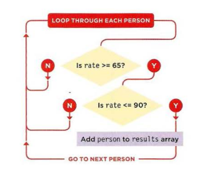
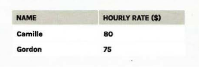

# FILTERING

Filtering lets you reduce a set of values. It allows you to create a subset of data that meets certain criteria.

To look at filtering, we will start with data about freelancers and their hourly rate. Each person is represented by an object literal

**JavaScript**

```js
var people = [
  { name: "Sam", rate: 70, active: true },
  { name: "John ", rate: 80, active: true },
  { name: "Simon", rate: 75, active: false },
  { name: "Nigel", rate: 120, active: true }
];
```

The data will be filtered before it is displayed. To do this we will loop through the objects that represent each person. If their rate is more than $65 and less than $90, they are put in a new array called results.



Result will be



## USING ARRAY METHODS TO FILTER DATA

The array object has two methods that are very useful for filtering data. Here you can see both used to filter the same set of data. As they filter the data, the items that pass a test are added to a new array.

Methods are:

- `forEach()`
- `filter()`

Let us see this example <a target="_blank" href="Chapter_12/Examples/c12/filter-filter.html">**Chapter_12/Examples/c12/filter-filter.html**</a>

**HTML**

```html
<!DOCTYPE html>
<html>
  <head>
    <title>
      JavaScript &amp; jQuery - Chapter 12: Filtering, Searching, and Sorting
    </title>
    <link rel="stylesheet" href="css/c12.css" />
  </head>
  <body>
    <header>
      <h1>CreativeFolk</h1>
    </header>

    <table id="rates">
      <thead>
        <tr>
          <th>Name</th>
          <th>Hourly rate ($)</th>
        </tr>
      </thead>
      <tbody></tbody>
    </table>

    <script src="js/filter-foreach.js"></script>
  </body>
</html>
```

**JavaScript**

```js
/**
 * By using pure JavaScript
 */
let people = [
  {
    // Each person is an object
    name: "Casey", // It holds name and rate
    rate: 60
  },
  {
    name: "Camille",
    rate: 80
  },
  {
    name: "Gordon",
    rate: 75
  },
  {
    name: "Nigel",
    rate: 120
  }
];

let tHead = document.getElementsByTagName("thead")[0];
let tBody = document.getElementsByTagName("tbody")[0];

/**
 * Create table data column and assign text to it.
 * @param {string} text
 * @return {HTMLElement}
 */
function nextTableData(text) {
  const td = document.createElement("td");
  td.textContent = text;
  return td;
}

/**
 * Function used to do filter on each single object.
 * @param {Object or any} person
 */
function priceRange(person) {
  return person.rate >= 65 && person.rate <= 90; // In range returns true
}

let results = []; // Array for matching people
results = people.filter(priceRange);

for (var i = 0; i < results.length; i++) {
  // Loop through matches
  let person = results[i]; // Store current person
  let tableRow = document.createElement("tr"); // Create a row for them
  tableRow.append(nextTableData(person.name)); // Add their name
  tableRow.append(nextTableData(person.rate)); // Add their rate
  tBody.append(tableRow); // Add row to new content
}
```

example found in <a target="_blank" href="Chapter_12/Examples/c12/filter-foreach.html">**Chapter_12/Examples/c12/filter-foreach.html**</a>

```js
/**
 * By using pure JavaScript
 */
let people = [
  {
    // Each person is an object
    name: "Casey", // It holds name and rate
    rate: 60
  },
  {
    name: "Camille",
    rate: 80
  },
  {
    name: "Gordon",
    rate: 75
  },
  {
    name: "Nigel",
    rate: 120
  }
];

let tHead = document.getElementsByTagName("thead")[0];
let tBody = document.getElementsByTagName("tbody")[0];

/**
 * Create table data column and assign text to it.
 * @param {string} text
 * @return {HTMLElement}
 */
function nextTableData(text) {
  const td = document.createElement("td");
  td.textContent = text;
  return td;
}

let results = []; // Array for matching people
people.forEach(function(person) {
  // For each person
  if (person.rate >= 65 && person.rate <= 90) {
    // Is rate in range
    results.push(person); // If yes add to array
  }
});

for (var i = 0; i < results.length; i++) {
  // Loop through matches
  let person = results[i]; // Store current person
  let tableRow = document.createElement("tr"); // Create a row for them
  tableRow.append(nextTableData(person.name)); // Add their name
  tableRow.append(nextTableData(person.rate)); // Add their rate
  tBody.append(tableRow); // Add row to new content
}
```

### References and Terms:

> :information*source: [interpreter](<https://en.wikipedia.org/wiki/Interpreter*(computing)>) check [Chapter_10/056_Understanding_errors](Chapter_10/056_Understanding_errors/Readme?id=references-and-terms)
